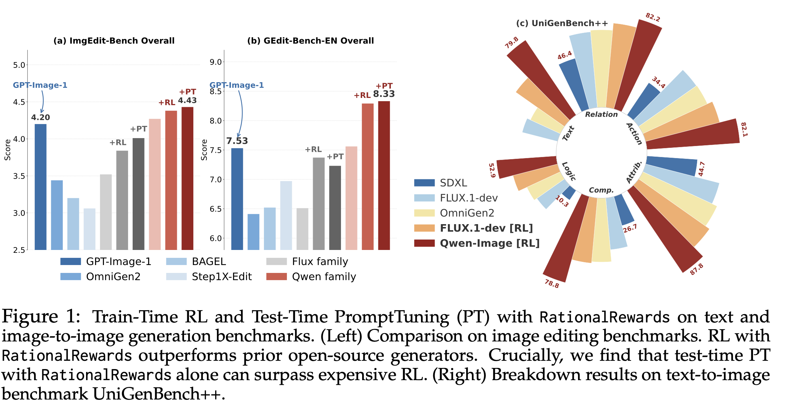
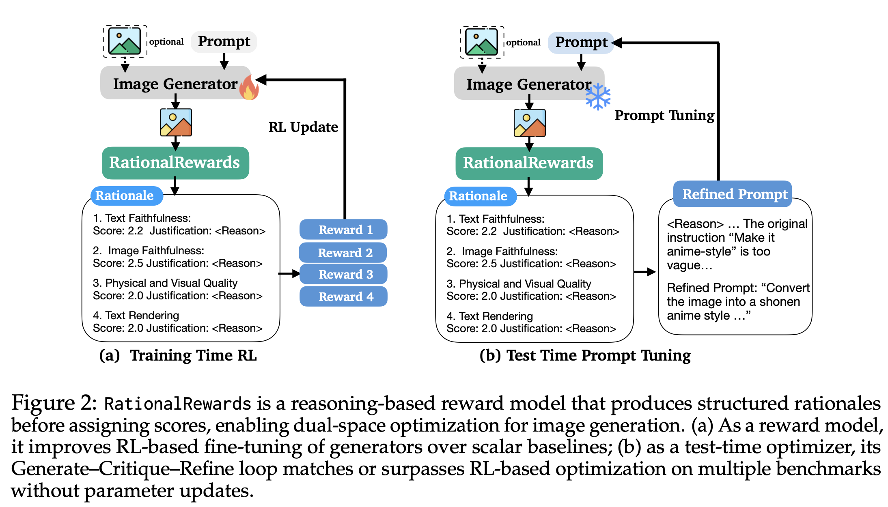
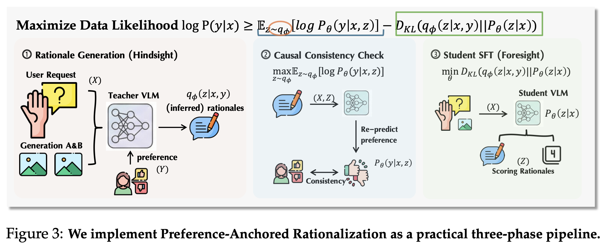
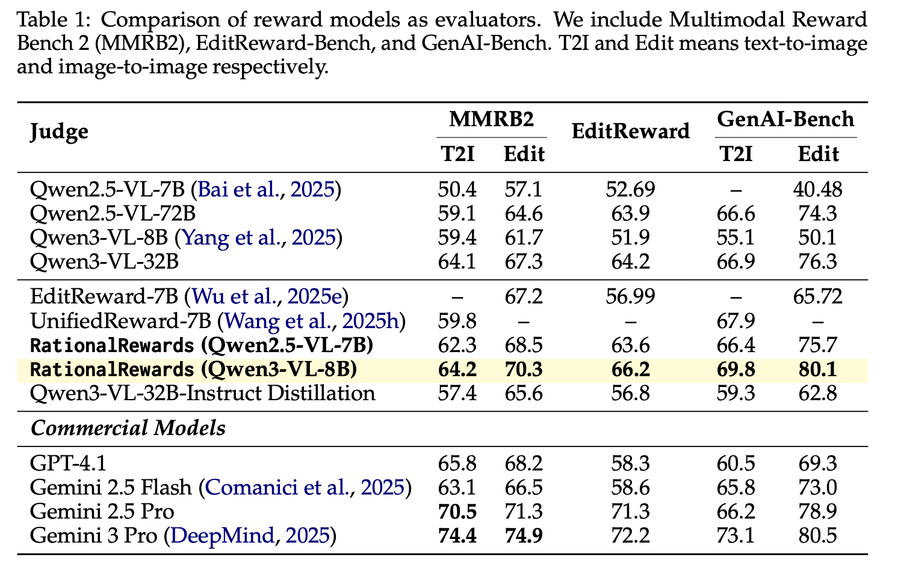
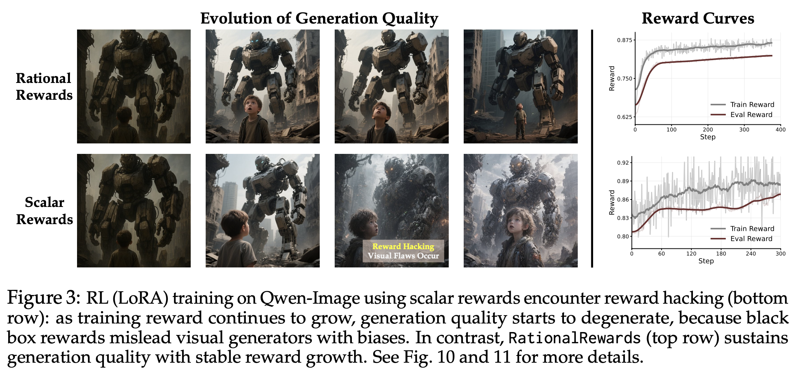
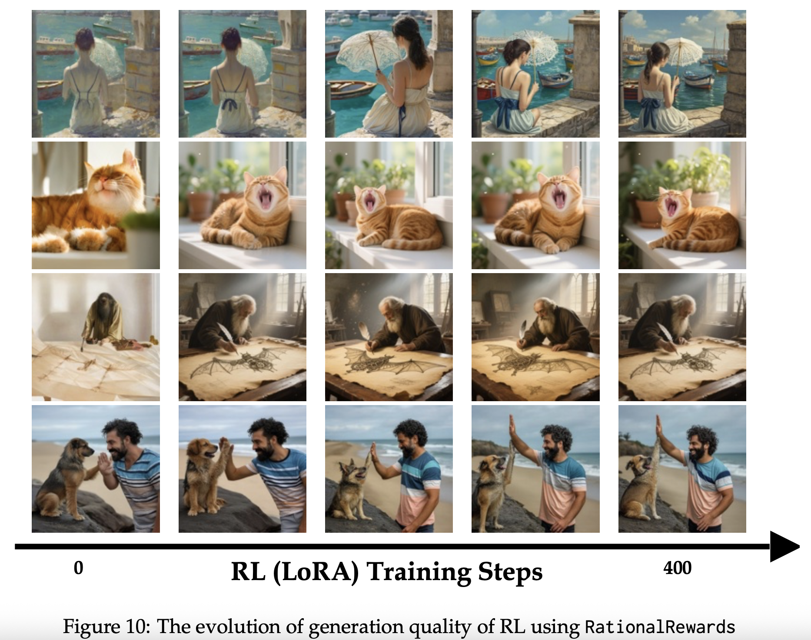
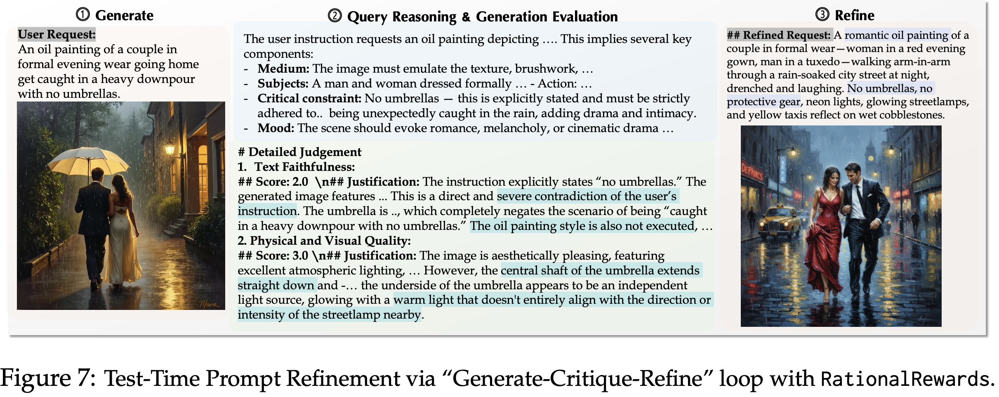
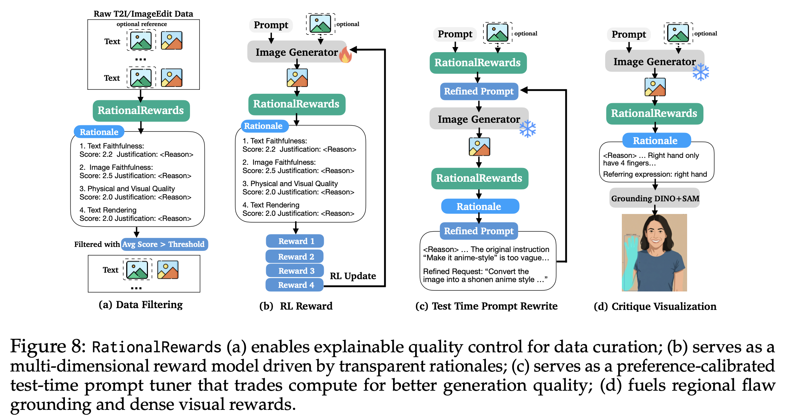

# RationalRewards: Reasoning Rewards Scale Visual Generation Both Training and Test Time

<div align="center">
  <strong>Haozhe Wang</strong><sup>1</sup> &nbsp;
  <strong>Cong Wei</strong><sup>2</sup> &nbsp;
  <strong>Weiming Ren</strong><sup>2</sup> &nbsp;
  <strong>Jiaming Liu</strong><sup>3</sup> &nbsp;
  <strong>Fangzhen Lin</strong><sup>1</sup> &nbsp;
  <strong>Wenhu Chen</strong><sup>2</sup><br>
  <sup>1</sup> HKUST &nbsp;
  <sup>2</sup> University of Waterloo &nbsp;
  <sup>3</sup> Alibaba
</div>

-----

<div align="center">
  <a href="https://arxiv.org/abs/2604.11626">
    
  </a>
  <a href="https://tiger-ai-lab.github.io/RationalRewards/">
    
  </a>
  <a href="https://github.com/TIGER-AI-Lab/RationalRewards">
    
  </a>
  <a href="https://huggingface.co/TIGER-Lab/RationalRewards-8B-T2I">
    
  </a>
  <a href="https://huggingface.co/TIGER-Lab/RationalRewards-8B-Edit">
    
  </a>
  <a href="https://huggingface.co/collections/TIGER-Lab/rationalrewards">
    
  </a>
  <br>
  <a href="https://huggingface.co/datasets/TIGER-Lab/RationalRewards-SFTData">
    
  </a>
  <a href="https://huggingface.co/datasets/TIGER-Lab/RationalRewards-EvalData-GenAIBench-MMRB2-ERBench">
    
  </a>
  <a href="https://huggingface.co/datasets/TIGER-Lab/RationalRewards_DiffusionNFT_TrainData">
    
  </a>
</div>

**RationalRewards** is a reasoning-based reward model and toolkit for visual generation. Instead of reducing preference into one opaque scalar, it generates explicit multi-dimensional critiques before scoring, turning reward models from passive evaluators into active optimization interfaces.

**About the name:** "Rational" means being reasonable, sensible, in Chinese, 理性的

**RationalRewards supports optimization in complementary spaces**:
- **train-time optimization** through RL with structured, interpretable reward signals, and
- **test-time optimization** through a Generate-Critique-Refine loop without parameter updates. 

## Key Results

Instantiated via PARROT on a Qwen3-VL-Instruct-8B backbone, RationalRewards achieves state-of-the-art preference prediction among open-source reward models and remains competitive with Gemini-2.5-Pro. As an RL reward, it consistently improves generators beyond scalar baselines across both text-to-image and image-editing tasks. Most interestingly, RationalRewards' test-time prompt tuning, requiring no parameter updates, matches or exceeds RL-based fine-tuning on several benchmarks.



*Train-time RL and test-time prompt tuning with RationalRewards across visual generation benchmarks.*

## Why Reasoning Rewards?

Most reward models collapse instruction following, visual quality, composition, and plausibility into one scalar. This removes the structure of human judgment and often leads to brittle optimization. RationalRewards keeps those dimensions explicit so generators receive semantically grounded feedback about what to fix and why.

### Why do reasoning rewards resist reward hacking?

Scalar rewards are vulnerable to reward hacking because they collapse rich
judgment into one number that can rise even when outputs do not truly improve.
RationalRewards introduces an implicit regularization: before giving scores, it
must produce coherent, multi-dimensional critiques tied to concrete evaluation
axes. This constrains optimization to evidence-backed reasoning and improves the
monotonic relationship between reward and observed quality during RL.

### Why are preference-trained rewards more stable than generic VLM judges?

Generic VLM judges can be strong analysts, but as reward functions they often
show high-variance pointwise scoring across semantically similar samples. That
variance becomes optimization noise in RL. PARROT trains RationalRewards
directly for preference discrimination, yielding lower-variance,
preference-aligned scores. The practical outcome is more stable optimization
steps and better reward reliability, even with a smaller model footprint.

### Why do reasoning rewards enable test-time scaling?

Reasoning feedback can be reused after generation, not only during training.
In a Generate-Critique-Refine loop, RationalRewards critiques the produced
image, identifies concrete deficiencies, and proposes targeted prompt updates.
Unlike pre-hoc prompt enhancement that rewrites blindly, this is post-hoc and
reactive to actual failures. That makes test-time compute more effective at
eliciting latent generator capability, often approaching or surpassing RL
fine-tuning gains without parameter updates.



*RationalRewards supports optimization in both parameter space (RL) and prompt space (test-time refinement).*

## Method: Preference-Anchored Rationalization (PARROT)

Human rationale annotation is expensive. PARROT recovers high-quality rationale supervision from preference-only data in three phases:
1. **Anchored generation:** a teacher VLM proposes rationale candidates consistent with known labels.
2. **Consistency filtering:** hallucinated or non-predictive rationales are removed.
3. **Distillation:** a student model learns to critique-before-score without seeing labels.

This gives a practical path from abundant preference datasets to scalable reasoning supervision.



*PARROT pipeline: anchored rationale generation, consistency filtering, and distillation.*

## Empirical Evidence

RationalRewards strengthens both alignment quality and downstream optimization.



*State-of-the-art preference prediction among open-source reward models.*



*Structured critique channels reduce shortcut exploitation compared with scalar-only rewards.*

To better show optimization behavior, we also include diffusion RL training
evolution results. The figure below visualizes how RationalRewards-guided
training improves over time, illustrating that benefits are not only visible at
the final checkpoint but emerge consistently throughout training. This constrast sharply with scalar rewards suffering reward hacking, as we demonstrate in Figure 12 in the paper.



*Evolution of diffusion RL performance under RationalRewards-guided optimization.*



*Generate-Critique-Refine at test time can match or exceed RL fine-tuning on several benchmarks.*



*Additional qualitative use cases enabled by explicit reasoning feedback.*

## News

- **[2026/04]** RationalRewards code release: SFT, reward-model evaluation, diffusion RL with RationalRewards, and test-time prompt tuning.
- **[2026/04]** RationalRewards-8B reward models and public datasets are available on Hugging Face.
- **[2026/04]** Paper preprint released on arXiv: [arXiv:2604.11626](https://arxiv.org/abs/2604.11626).

## Environment Setup

We recommend Linux + CUDA GPUs with **separate Python environments** for each module.

This repository builds on:
- [LLaMA-Factory](https://github.com/hiyouga/LLaMA-Factory) for SFT
- [vLLM](https://github.com/vllm-project/vllm) for reward-model serving
- [Edit-R1](https://github.com/PKU-YuanGroup/Edit-R1) for RL environment conventions
- [DiffusionNFT](https://github.com/NVlabs/DiffusionNFT) for diffusion RL design references
- [diffusers](https://github.com/huggingface/diffusers) for inference and training ecosystem support

Install upstream dependencies first:
1. SFT setup: [LLaMA-Factory Installation](https://github.com/hiyouga/LLaMA-Factory#installation)
2. Reward serving setup: [vLLM Installation](https://github.com/vllm-project/vllm)
3. RL setup: [Edit-R1 Environment Setup](https://github.com/PKU-YuanGroup/Edit-R1#-environment-set-up)

Then follow module-level READMEs:
- `rationalrewards_sft/README.md`
- `reward_model_evaluation/README.md`
- `diffusion_rl_training/README.md`
- `test_time_prompt_tuning/README.md`

## Quick Start

All scripts are environment-variable driven. Replace `/path/to/...` placeholders with local paths.

### 1) Train RationalRewards with SFT
```bash
bash rationalrewards_sft/run_sft.sh
```

### 2) Start reward-model server
```bash
vllm serve /path/to/rationalrewards_checkpoint --port 6868
```

### 3) Run pairwise reward-model evaluation
```bash
bash reward_model_evaluation/run_evaluation.sh
```

### 4) Run diffusion RL training with RationalRewards feedback
```bash
bash diffusion_rl_training/run_rl_training.sh
```

### 5) Run test-time prompt tuning (Generate-Critique-Refine)
```bash
bash test_time_prompt_tuning/run_test_time_tuning.sh
```

## vLLM Inference Templates and Parsing

### T2I (message construction + parsing + usage)

```python
import base64
import math
import re
import requests


def extract_numeric_score(score_value):
    if score_value is None:
        raise ValueError("Score value is None")
    if score_value == "N/A":
        return "N/A"
    if isinstance(score_value, (int, float)):
        return float(score_value)
    if isinstance(score_value, str):
        match = re.match(r"^\s*(\d+(?:\.\d+)?)", score_value.strip())
        if match:
            return float(match.group(1))
    raise ValueError("Could not parse score: {}".format(score_value))


def build_t2i_messages(prompt, image_bytes):
    system_prompt = (
        "You are an expert image generation evaluator. Your task is to evaluate "
        "the quality of a generated image based on a user instruction. Afterwards, "
        "you need to suggest how to refine the original user request to produce "
        "better image generation (if any)."
    )
    image_b64 = base64.b64encode(image_bytes).decode()
    user_instruction = f"""User Instruction: {prompt}
You are provided with one image:
1. Generated Image <image>

To do this, you must first assess the image on three critical aspects, provide justifications and absolute scores in 1-4 scale.

### Critical Aspects & Scoring Rubric
**1. Text Faithfulness** (How accurately does the output follow the instruction?)
- **4 (Full match):** All key elements (objects, colors, actions) are represented exactly as described. No hallucinations or unrequested changes.
- **3 (Minor mismatch):** Most key elements are present, but minor details are missing, incorrect, or slightly inaccurate.
- **2 (Some mismatch):** Some key elements are missing, altered, or interpreted incorrectly.
- **1 (Major deviations):** Key elements are completely missing, altered, or contradicted. Instruction is ignored.

**2. Physical and Visual Quality** (Technical errors, composition, realism, and physics)
- **4 (No noticeable flaws):** The image is physically plausible (correct lighting, shadows, geometry, anatomy). No visible artifacts (seams, blurring, noise).
- **3 (Minor flaws):** Small inaccuracies that are noticeable but not strongly disruptive (e.g., slight lighting mismatch, minor texture issues).
- **2 (Some flaws):** Clear physical or visual errors that disrupt the image (e.g., incorrect perspective, "floating" objects, wrong shadow direction, obvious seams).
- **1 (Severe flaws):** Major physical/visual errors (e.g., impossible geometry, distorted anatomy, garbled objects, severe artifacts).

**3. Text Rendering** (Only if the instruction involves generating text)
- **4 (Full match):** Text is correct, legible, and integrated well.
- **3 (Mostly match):** Minor misspellings or inconsistent capitalization.
- **2 (Partial match):** Major misspellings or distorted text.
- **1 (Major deviations):** Text is unreadable, severely distorted, or missing. (Use N/A if no text generation is required).

### Scoring Methodology (CRITICAL)
During assessment for each aspect, recall the initial user request and the scoring rubrics of the aspect, provide scores with detailed justifications for the generated image and reflect fine-grained preferences.
1. **Anchor:** Have a global inspection based on the user request and the resulting generation. Determine the rough integer score level (1, 2, 3, or 4) according to the definitions provided.
2. **Justify and Adjust:** Do careful visual analysis and identify specific flaws in generation. Justify the score with concrete evidence and scoring logic. Fine-tune this anchor score into a float value. Add small increments for exceptional execution or deduct points for specific flaws.
   - *Example:* deduct points from 4.0 for slight flaws if the assessed dimension is close to satisfaction. add increments from 1.0 or 2.0 based on severity of flaws.

Afterwards, try to construct a refined user request that helps the visual generation model to produce better image generation.
Think of the weaknesses identified in the judgement, then map them to instruction details and apply specific fixes.
Provide a final new user request that enrich the initial user request.

Output your evaluation in the following format:
# User Request Analysis
[ understanding the user request, try to analyze or decompose the user request deeper. Think of what the request might imply or what needs to be inferred to successfully execute the request. ]
# Detailed Judgement
1. Text Faithfulness:
## Justification: [ Analysis of the user request and the assessment of the resulting generation. How it comes to a final score. ]
## Score: [ float score ]
2. Physical and Visual Quality:
## Justification: [ Similar to above. Analysis and assessment. ]
## Score: [ float score ]
3. Text Rendering:
## Justification: [ Similar to above. Analysis and assessment. ]
## Score: [ float score or N/A ]
# Summary: [ Summary of the evaluation ]

# User Request Refinement:
## Refinement Comments: [Specific suggestions for improving the user request]
## Refined Request: [The improved, more specific user request for generation like a standard user instruction]"""
    parts = user_instruction.split("<image>")
    content = [
        {"type": "text", "text": parts[0]},
        {"type": "image_url", "image_url": {"url": f"data:image/png;base64,{image_b64}"}},
    ]
    if len(parts) > 1:
        content.append({"type": "text", "text": parts[1]})
    return [
        {"role": "system", "content": system_prompt},
        {"role": "user", "content": content},
    ]


def parse_t2i_scores(raw_response, aspects=("text_faithfulness", "physical_quality", "text_rendering")):
    result = {"text_faithfulness": None, "physical_quality": None, "text_rendering": None}
    content_body = raw_response.split("# Summary:")[0] if "# Summary:" in raw_response else raw_response
    section_blocks = {}
    current_section = None
    current_block = []
    for raw_line in content_body.split("\n"):
        stripped = raw_line.strip()
        if stripped.startswith("1.") and "Text Faithfulness" in stripped:
            if current_section:
                section_blocks[current_section] = "\n".join(current_block)
            current_section = "text_faithfulness"
            current_block = [raw_line]
        elif stripped.startswith("2.") and "Physical and Visual Quality" in stripped:
            if current_section:
                section_blocks[current_section] = "\n".join(current_block)
            current_section = "physical_quality"
            current_block = [raw_line]
        elif stripped.startswith("3.") and "Text Rendering" in stripped:
            if current_section:
                section_blocks[current_section] = "\n".join(current_block)
            current_section = "text_rendering"
            current_block = [raw_line]
        elif current_section:
            current_block.append(raw_line)
    if current_section:
        section_blocks[current_section] = "\n".join(current_block)

    for k, block_text in section_blocks.items():
        for line in block_text.split("\n"):
            m = re.search(r"(?:##\s*)?Score\s*:\s*(.+)$", line.strip(), re.IGNORECASE)
            if m:
                try:
                    result[k] = extract_numeric_score(m.group(1).strip())
                    break
                except ValueError:
                    continue

    valid_scores = []
    for a in aspects:
        s = result.get(a)
        if s is not None and s != "N/A":
            v = max(1.0, min(4.0, float(s)))
            if math.isfinite(v):
                valid_scores.append(v)
    normalized = (sum(valid_scores) / len(valid_scores) - 1.0) / 3.0 if valid_scores else 0.0
    normalized = max(0.0, min(1.0, normalized))
    return normalized, result


# --- usage example ---
with open("/path/to/generated.png", "rb") as f:
    image_bytes = f.read()

messages = build_t2i_messages("A red vintage car parked beside a lake at sunset", image_bytes)
payload = {
    "model": "Qwen3-VL-8B-Instruct",
    "messages": messages,
    "temperature": 0.1,
    "max_tokens": 2048,
}
resp = requests.post("http://localhost:8000/v1/chat/completions", json=payload, timeout=300).json()
raw_text = resp["choices"][0]["message"]["content"]
score, parsed_scores = parse_t2i_scores(raw_text)
print(score, parsed_scores)
```

### I2I (message construction + parsing + usage)

```python
import base64
import re
import requests


def extract_numeric_score(score_value):
    if score_value is None:
        raise ValueError("Score value is None")
    if score_value == "N/A":
        return "N/A"
    if isinstance(score_value, (int, float)):
        return float(score_value)
    if isinstance(score_value, str):
        match = re.match(r"^\s*(\d+(?:\.\d+)?)", score_value.strip())
        if match:
            return float(match.group(1))
    raise ValueError("Could not parse score: {}".format(score_value))


def build_i2i_messages(prompt, source_image_bytes, edited_image_bytes):
    system_prompt = (
        "You are an expert image editing evaluator. Your task is to evaluate the quality of an edited "
        "image based on a source image and a user instruction. Afterwards, you need to suggest how to "
        "refine the original user request to produce better image edits (if any)."
    )
    task_related_template = """User Instruction: {request}
You are provided with two images:
1. Source Image <image>
2. Edited Image <image>

Give your analysis and judgement following guidelines in the system prompt. """
    common_task_guideline = """To do this, you must first assess the image on four critical aspects, provide justifications and absolute scores in 1-4 scale.

### Critical Aspects & Scoring Rubric
**1. Text Faithfulness** (How accurately does the output follow the instruction?)
- **4 (Full match):** All key elements (objects, colors, actions) are represented exactly as described. No hallucinations or unrequested changes.
- **3 (Minor mismatch):** Most key elements are present, but minor details are missing, incorrect, or slightly inaccurate.
- **2 (Some mismatch):** Some key elements are missing, altered, or interpreted incorrectly.
- **1 (Major deviations):** Key elements are completely missing, altered, or contradicted. Instruction is ignored.

**2. Image Faithfulness** (How well are the non-edited parts and key input elements preserved?)
- **4 (Uses input fully):** All relevant elements from the input (background, style, lighting, identity) are accurately preserved or transformed as instructed.
- **3 (Minor mismatch):** Most relevant elements are preserved, but a few aspects (e.g., background details, lighting consistency) are missing or incorrectly handled.
- **2 (Partial mismatch):** Some elements are carried over, but key aspects of the original image are lost or distorted.
- **1 (Fails to use input):** Key elements of the input image are ignored, misinterpreted, or destroyed.

**3. Physical and Visual Quality** (Technical errors, composition, realism, and physics)
- **4 (No noticeable flaws):** The image is physically plausible (correct lighting, shadows, geometry, anatomy). No visible artifacts (seams, blurring, noise).
- **3 (Minor flaws):** Small inaccuracies that are noticeable but not strongly disruptive (e.g., slight lighting mismatch, minor texture issues).
- **2 (Some flaws):** Clear physical or visual errors that disrupt the image (e.g., incorrect perspective, "floating" objects, wrong shadow direction, obvious seams).
- **1 (Severe flaws):** Major physical/visual errors (e.g., impossible geometry, distorted anatomy, garbled objects, severe artifacts).

**4. Text Rendering** (Only if the instruction involves generating text)
- **4 (Full match):** Text is correct, legible, and integrated well.
- **3 (Mostly match):** Minor misspellings or inconsistent capitalization.
- **2 (Partial match):** Major misspellings or distorted text.
- **1 (Major deviations):** Text is unreadable, severely distorted, or missing. (Use N/A if no text generation is required).

### Scoring Methodology (CRITICAL)
During assessment for each aspect, recall the initial user request, source image and the scoring rubrics of the aspect, provide scores with detailed justifications for each image and reflect fine-grained preferences.
1. **Anchor:** Have a global inspection based on the user request and the resulting generation. Determine the rough integer score level (1, 2, 3, or 4) according to the definitions provided .
2. **Justify and Adjust:** Do careful visual analysis and identify specific flaws in generation. Justify the score with concrete evidence and scoring logic. Fine-tune this anchor score into a float value. Add small increments for exceptional execution or deduct points for specific flaws.
   - *Example:* deduct points from 4.0 for slight flaws if the assessed dimension is close to satisfaction. add increments from 1.0 or 2.0 based on severity of flaws.

Afterwards, try to construct a refined user request that helps the visual generation model to produce better image edits.
Think of the weaknesses identified in the judgement, then map them to instruction details and apply specific fixes.
Provide a final new user request that enrich the initial user request.

Output your evaluation in the following format:
# User Request Analysis
[ understanding the user request, try to analyze or decompose the user request deeper. Think of what the request might imply or what needs to be inferred to successfully execute the request. ]
# Detailed Judgement
1. Text Faithfulness:
## Justification: [ Analysis of the user request and the assessment of the resulting generation. How it comes to a final score. ]
## Score: [ float score ]
2. Image Faithfulness:
## Justification: [ Similar to above. Analysis and assessment. ]
## Score: [ float score ]
3. Physical and Visual Quality:
## Justification: [ Similar to above. Analysis and assessment. ]
## Score: [ float score ]
4. Text Rendering:
## Justification: [ Similar to above. Analysis and assessment. ]
## Score: [ float score or N/A ]
# Summary: [ Summary of the evaluation ]

# User Request Refinement:
## Refinement Comments: [Specific suggestions for improving the user request]
## Refined Request: [The improved, more specific user request for editing like a standard user instruction]"""
    user_instruction = "{}\n\n{}".format(
        task_related_template.format(request=prompt),
        common_task_guideline,
    )
    source_b64 = base64.b64encode(source_image_bytes).decode()
    edited_b64 = base64.b64encode(edited_image_bytes).decode()
    parts = user_instruction.split("<image>")
    content = [
        {"type": "text", "text": parts[0]},
        {"type": "image_url", "image_url": {"url": f"data:image/png;base64,{source_b64}"}},
        {"type": "text", "text": parts[1]},
        {"type": "image_url", "image_url": {"url": f"data:image/png;base64,{edited_b64}"}},
    ]
    if len(parts) > 2:
        content.append({"type": "text", "text": parts[2]})
    return [
        {"role": "system", "content": system_prompt},
        {"role": "user", "content": content},
    ]


def parse_i2i_scores(raw_response, aspects=("text_faithfulness", "image_faithfulness", "physical_quality", "text_rendering")):
    result = {
        "text_faithfulness": {"score": None, "justification": ""},
        "image_faithfulness": {"score": None, "justification": ""},
        "physical_quality": {"score": None, "justification": ""},
        "text_rendering": {"score": None, "justification": ""},
    }
    content_body = raw_response.split("# Summary:")[0] if "# Summary:" in raw_response else raw_response
    h1 = "Text Faithfulness:"
    h2 = "Image Faithfulness:"
    h3 = "Physical and Visual Quality:"
    h4 = "Text Rendering:"
    if h1 in content_body:
        _, _, rest = content_body.partition(h1)
        block_tf, _, rest = rest.partition(h2) if h2 in rest else (rest, "", "")
        block_if, _, rest = rest.partition(h3) if h3 in rest else (rest, "", "")
        block_pq, _, rest = rest.partition(h4) if h4 in rest else (rest, "", "")
        block_tr = rest
    else:
        sections = re.split(r"\n\s*\d+\.\s+", content_body)
        block_tf = sections[1] if len(sections) > 1 else ""
        block_if = sections[2] if len(sections) > 2 else ""
        block_pq = sections[3] if len(sections) > 3 else ""
        block_tr = sections[4] if len(sections) > 4 else ""

    sections = {
        "text_faithfulness": block_tf,
        "image_faithfulness": block_if,
        "physical_quality": block_pq,
        "text_rendering": block_tr,
    }
    for k, block in sections.items():
        for line in block.split("\n"):
            line = line.strip()
            if "## Score:" in line:
                raw_val = line.split("## Score:")[-1].strip().strip("*").strip()
                try:
                    result[k]["score"] = extract_numeric_score(raw_val)
                    break
                except ValueError:
                    continue
        if "Justification:" in block:
            result[k]["justification"] = block.split("Justification:")[-1].strip().split("## Score")[0].strip()

    valid_scores = []
    for a in aspects:
        s = result.get(a, {}).get("score")
        if s is not None and s != "N/A":
            valid_scores.append(float(s))
    normalized = (sum(valid_scores) / len(valid_scores) - 1.0) / 3.0 if valid_scores else 0.0
    return normalized, result


# --- usage example ---
with open("/path/to/source.png", "rb") as f:
    source_image_bytes = f.read()
with open("/path/to/edited.png", "rb") as f:
    edited_image_bytes = f.read()

messages = build_i2i_messages(
    "Replace the cloudy sky with a dramatic sunset while preserving buildings and perspective.",
    source_image_bytes,
    edited_image_bytes,
)
payload = {
    "model": "Qwen3-VL-8B-Instruct",
    "messages": messages,
    "temperature": 0.1,
    "max_tokens": 2048,
}
resp = requests.post("http://localhost:8000/v1/chat/completions", json=payload, timeout=300).json()
raw_text = resp["choices"][0]["message"]["content"]
score, parsed_scores = parse_i2i_scores(raw_text)
print(score, parsed_scores)
```

## Public Models and Datasets

- Reward model (T2I): [TIGER-Lab/RationalRewards-8B-T2I](https://huggingface.co/TIGER-Lab/RationalRewards-8B-T2I)
- Reward model (Edit): [TIGER-Lab/RationalRewards-8B-Edit](https://huggingface.co/TIGER-Lab/RationalRewards-8B-Edit)
- SFT training data: [TIGER-Lab/RationalRewards-SFTData](https://huggingface.co/datasets/TIGER-Lab/RationalRewards-SFTData)
- Preference evaluation data: [TIGER-Lab/RationalRewards-EvalData-GenAIBench-MMRB2-ERBench](https://huggingface.co/datasets/TIGER-Lab/RationalRewards-EvalData-GenAIBench-MMRB2-ERBench)
- RL training data: [TIGER-Lab/RationalRewards_DiffusionNFT_TrainData](https://huggingface.co/datasets/TIGER-Lab/RationalRewards_DiffusionNFT_TrainData)

## Repository Structure

- `rationalrewards_sft/`: SFT training for RationalRewards.
- `reward_model_evaluation/`: pairwise reward inference and aggregation.
- `diffusion_rl_training/`: diffusion RL training with RationalRewards signals.
- `test_time_prompt_tuning/`: critique-guided inference-time prompt refinement.

## Acknowledgements

RationalRewards is built with and inspired by open-source projects, especially:
- [DiffusionNFT](https://github.com/NVlabs/DiffusionNFT)
- [Edit-R1](https://github.com/PKU-YuanGroup/Edit-R1)
- [LLaMA-Factory](https://github.com/hiyouga/LLaMA-Factory)
- [diffusers](https://github.com/huggingface/diffusers)
- [vLLM](https://github.com/vllm-project/vllm)

## Citation

```bibtex
@article{rationalrewards2026,
  title   = {RationalRewards: Reasoning Rewards Scale Visual Generation Both Training and Test Time},
  author  = {Haozhe Wang and Cong Wei and Weiming Ren and Jiaming Liu and Fangzhen Lin and Wenhu Chen},
  journal = {arXiv preprint},
  year    = {2026}
}
```
